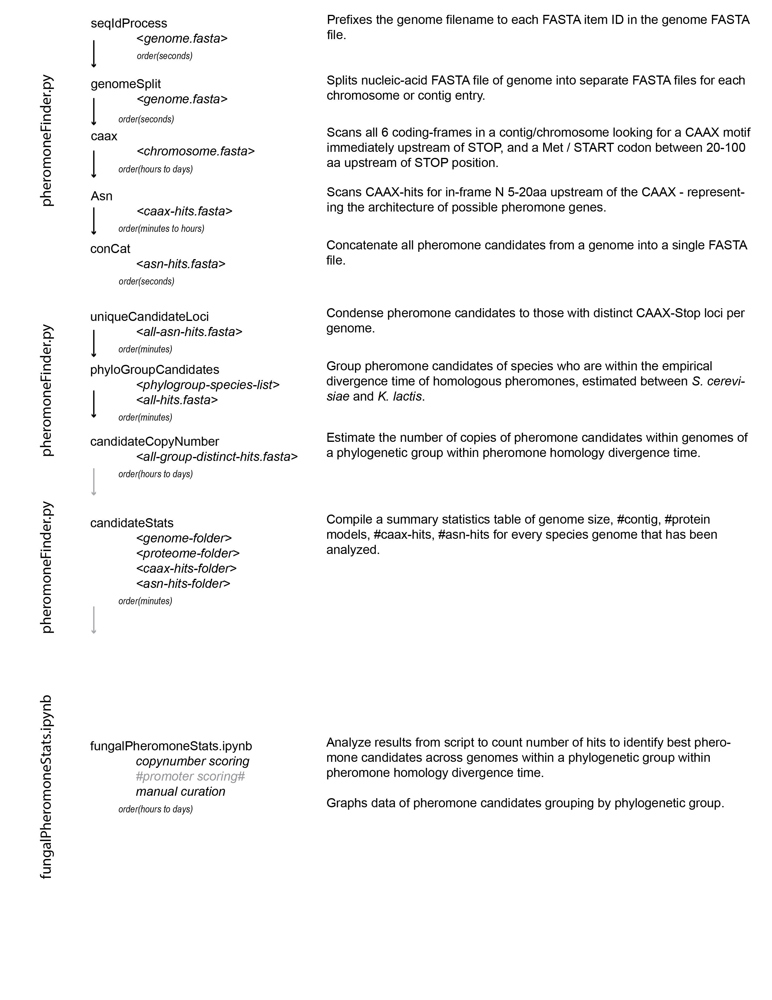

# pheromoneFinder
<i>Written by Sri Srikant, as part of graduate research in the labs of Andrew Murray and Rachelle Gaudet.</i>

Code-base to identify fungal pheromones from genome sequences. Written for publication being prepared from the Murray Lab. Started writing the code to identify the pheromone of yeasts from the Saccharomcotina. Run on 332 yeast genomes available from Shen X, et al (2018).

Code:
1. scripts/pheromoneFinder_current.py:	Python scripts written to be used with SLURM scheduler on Odyssey cluster at Harvard. Functions within the code provide the methods to be run in sequence to identify pheromone candidates from fungal genome sequences. Primarily used with genomes of yeasts in the Saccharomycotina clade of Ascomyctoa.
2. notebooks/fungalPheromoneStats_*yymmdd*.ipynb:	Python notebook written in python 2.7 to analyze pheromone candidates and summary stats. Code-cells to generate figures for publication lested above.

Data:
1. data/Tables_*yymmdd*.xlxs: Excel file including Tables from publication to make it easy for analysis by readers.
2. data/analysis-tree.png: Illustration of order of analysis using codebase starting from genome file to obtain pheromone candidate genes, including scoring of candidates within genomes and in phylogenetic context.

Analysis pipeline

